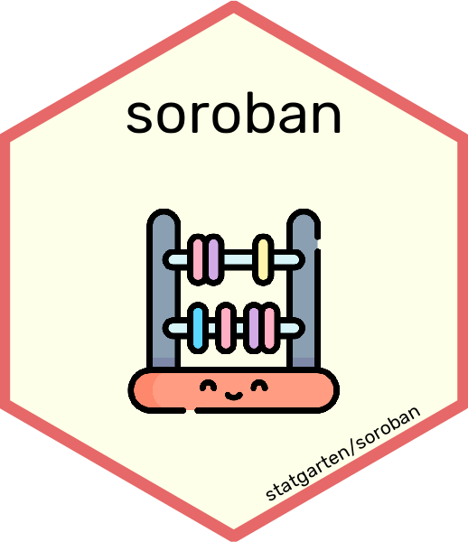

# :yellow_heart: soroban 

Statistics functions compatible with shiny

## :clipboard: Dependency

-   [caret](https://github.com/topepo/caret) - 6.0-93
-   [colourpicker](https://github.com/daattali/colourpicker) - 1.1.0
-   [dplyr](https://github.com/tidyverse/dplyr/) - 1.0.10
-   [factoextra](https://github.com/kassambara/factoextra) - 1.0.7
-   [partykit](http://partykit.r-forge.r-project.org/partykit/) - 1.2-16
-   [plotly](https://github.com/plotly/plotly.R) - 4.10.0
-   [reactable](https://github.com/glin/reactable/) - 0.3.0
-   [shinyjs](https://github.com/daattali/shinyjs) - 2.1.0
-   [showtext](https://github.com/yixuan/showtext) - 0.9-5

## :wrench: Install

``` r
remotes::install_github('statgarten/soroban')
library(soroban)
```

## :+1: Recommended package to use soroban

-   [datamods](https://github.com/dreamRs/datamods)
-   [door](https://github.com/statgarten/door)

## :blush: Authors

-   :octocat: JInhwan Kim [\@jhk0530](http://github.com/jhk0530)

## :memo: License

Copyright :copyright: 2022 Jinhwan Kim This project is [MIT](https://opensource.org/licenses/MIT) licensed

*This README was generated with :two_hearts: by [shinyReadme](http://github.com/jhk0530/shinyReadme)*
