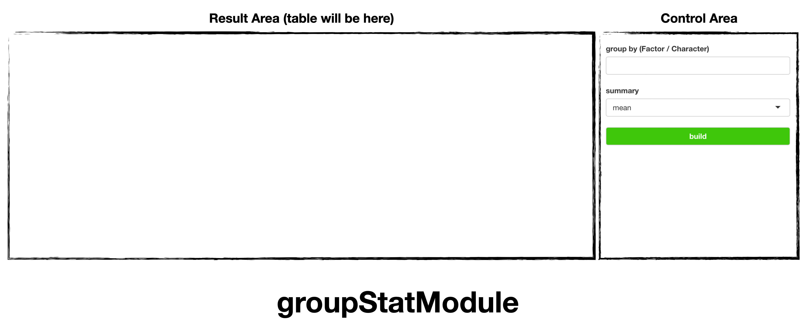
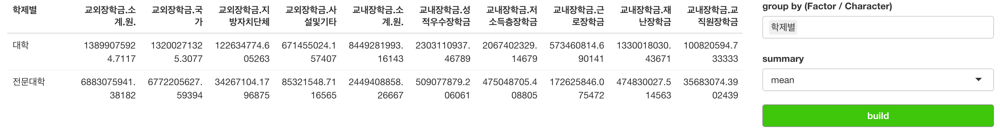

```{r, include = FALSE}
knitr::opts_chunk$set(
  collapse = TRUE,
  comment = "#>"
)
```

## Introduction

`soroban`'s `groupStatModule` performs [Aggregation](https://en.wikipedia.org/wiki/Aggregate_function).

In this article, we'll use `scholarship` dataset of [datatoys](https://github.com/statgarten/datatoys)

This article is based on **0.0.1** Version of soroban

## Declare module

`soroban`'s module assumes that used in the [Shiny](https://shiny.rstudio.com/) application.

and You can use snippet(type `shinyapp`) to build very basic shiny application.

``` r
library(shiny)

ui <- fluidPage(
 
)

server <- function(input, output, session) {
  
}

shinyApp(ui, server)
```

This application will show nothing.

So let's add `treeModule` in **ui**.

``` r
ui <- fluidPage(
  mod_groupStatModule_ui(
    id = 'module'
  )
)
```

also, `treeModule` in **server**.

``` r
server <- function(input, output, session) {
  mod_groupStatModule_server(
    id = 'module', 
    inputData = reactive(datatoys::scholarship)
  )
}
```

So final (which is very basic) code will like this. (Assume data from `AER` loaded.)

``` r
library(shiny)

ui <- fluidPage(
  mod_groupStatModule_ui(
    id = 'module'
  )
)

server <- function(input, output, session) {
  mod_groupStatModule_server(
    id = 'module', 
    inputData = reactive(datatoys::scholarship)
  )
}

shinyApp(ui, server) # Run application
```

You should notice 2 things.

1.  both `id` in **ui** and **server** should be same.
2.  `inputData` in **server** should be format of **reactive**

## Structure of treeModule



groupStatModule is consisted with `Control Area` and `Result Area`

and below using flow.

1.  Declare module (we did already)
2.  Select `group` and `summary` metric.
3.  `build`

## Usage of groupStatModule

Using `scholarship`, we'll see summary metric by catetory of university.

Set `group by` as `학제별` and `summary` as `mean`.



this result shows that.

university with category `대학` (university), their average scholarship (교외장학금) will be near 13.9 Billion. 

and university with category `전문대학` (college), their average scholarship will be near 6.8 Billion. (almost X2)

* groupStatModule supports multiple group. that is not only `학제별`, other options can be choose.

For any issue or suggestion, please make issue in [soroban's github](https://github.com/statgarten/soroban/issues).
