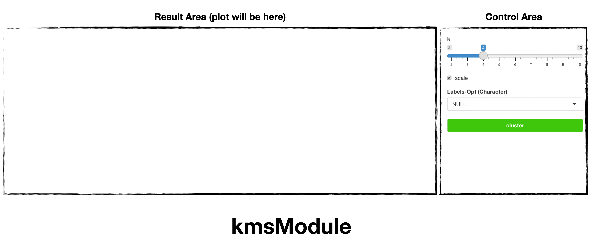
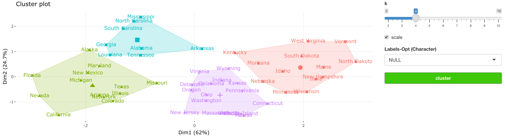

```{r, include = FALSE}
knitr::opts_chunk$set(
  collapse = TRUE,
  comment = "#>"
)
```

## Introduction

`soroban`'s `kmsModule` generates [k-means cluster](https://en.wikipedia.org/wiki/K-means_clustering).

In this article, we'll use `USArrests` dataset of [datasets](https://rdrr.io/r/datasets/datasets-package.html), which can be just use by `data("USArrests")`

This article is based on **0.0.1** Version of soroban

## Declare module

`soroban`'s module assumes that used in the [Shiny](https://shiny.rstudio.com/) application.

and You can use snippet(type `shinyapp`) to build very basic shiny application.

``` r
library(shiny)

ui <- fluidPage(
 
)

server <- function(input, output, session) {
  
}

shinyApp(ui, server)
```

This application will show nothing.

So let's add `treeModule` in **ui**.

``` r
ui <- fluidPage(
  mod_kmsModule_ui(
    id = 'module'
  )
)
```

also, `treeModule` in **server**.

``` r
server <- function(input, output, session) {
  mod_kmsModule_server(
    id = 'module', 
    inputData = reactive(datasets::USArrests)
  )
}
```

So final (which is very basic) code will like this. (Assume data from `AER` loaded.)

``` r
library(shiny)

ui <- fluidPage(
  mod_kmsModule_ui(
    id = 'module'
  )
)

server <- function(input, output, session) {
  mod_kmsModule_server(
    id = 'module', 
    inputData = reactive(datasets::USArrests)
  )
}

shinyApp(ui, server) # Run application

```

You should notice 2 things.

1.  both `id` in **ui** and **server** should be same.
2.  `inputData` in **server** should be format of **reactive**

## Structure of kmsModule



treeModule is consisted with `Control Area` and `Result Area`

and below using flow.

1.  Declare module (we did already)
2.  select `K`
3.  build `Cluster`

* If data has different scale (not normalized), check `scale`.

* If data has label (name), you can select if as `Labels-Opt`

## Usage of kmsModule

Using `USArrests`, we'll group city by their similarity.

Set K as 4



For any issue or suggestion, please make issue in [soroban's github](https://github.com/statgarten/soroban/issues).
