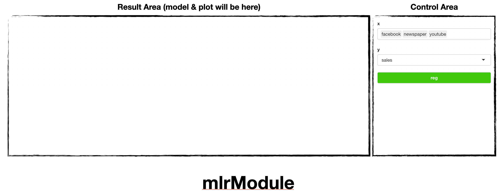
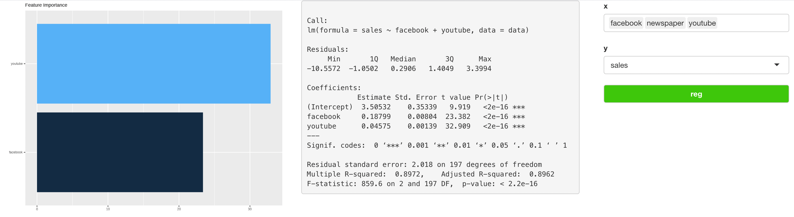

```{r, include = FALSE}
knitr::opts_chunk$set(
  collapse = TRUE,
  comment = "#>"
)
```

## Introduction

`soroban`'s `mlrModule` perform [Multiple Linear Regression](https://en.wikipedia.org/wiki/Linear_regression) analysis and shows linear model & [variable importance](https://stats.stackexchange.com/questions/332960/what-is-variable-importance).

In this article, we'll use `marketing` dataset of [datarium](https://github.com/kassambara/datarium)

This article is based on **0.0.1** Version of soroban

datarium::marketing


## Declare module

`soroban`'s module assumes that used in the [Shiny](https://shiny.rstudio.com/) application.

and You can use snippet(type `shinyapp`) to build very basic shiny application.

``` r
library(shiny)

ui <- fluidPage(
 
)

server <- function(input, output, session) {
  
}

shinyApp(ui, server)
```

This application will show nothing.

So let's add `pcaModule` in **ui**.

``` r
ui <- fluidPage(
  mod_mlrModule_ui(
    id = 'module'
  )
)
```

also, `pcaModule` in **server**.

``` r
server <- function(input, output, session) {
  mod_mlrModule_server(
    id = 'module', 
    inputData = reactive(datarium::marketing)
  )
}
```

So final (which is very basic) code will like this. (Assume data from `AER` loaded.)

``` r
library(shiny)

ui <- fluidPage(
  mod_mlrModule_ui(
    id = 'module'
  )
)

server <- function(input, output, session) {
  mod_mlrModule_server(
    id = 'module', 
    inputData = reactive(datarium::marketing) # remotes::install_github('kassambara/datarium')
  )
}

shinyApp(ui, server) # Run application

```

You should notice 2 things.

1.  both `id` in **ui** and **server** should be same.
2.  `inputData` in **server** should be format of **reactive**

## Structure of pcaModule



pcaModule is consisted with `Control Area` and `Result Area`

and below using flow.

1.  Declare module (we did already)
2.  select explain, response variables 
3.  `Reg` (Regression !)

## Usage of mlrModule

Using `marketing`, we'll see which factor makes sales.

Select `facebook`, `newspaper`, and `youtube` as **X** and `sales` as **Y**



You can see variable importance in left, (which means `Youtube` has more effect on sales then `Facebook`)

and model in right panel ( $sales \approx 0.1878 \times facebook + 0.045 \times youtube + 3.505$ )

Note that, `mlrModule` automatically select model by AIC ([stepwise](https://stat.ethz.ch/R-manual/R-devel/library/stats/html/stepfun.html)) so newspaper was removed in that process (it may have very small effect to sales)

For any issue or suggestion, please make issue in [soroban's github](https://github.com/statgarten/soroban/issues).
