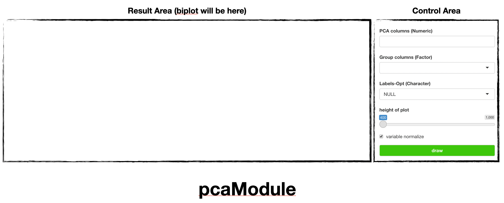
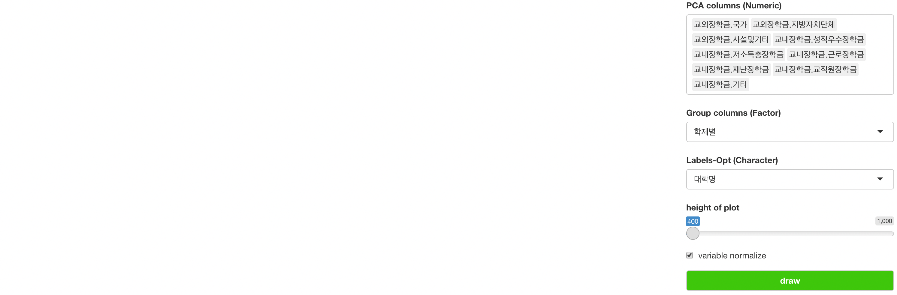
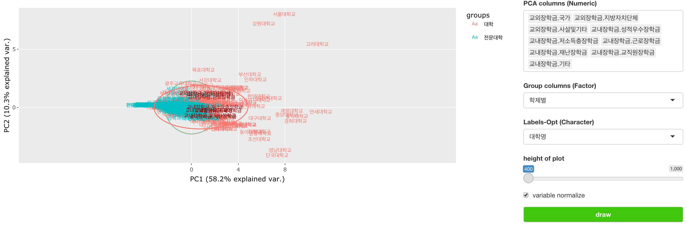
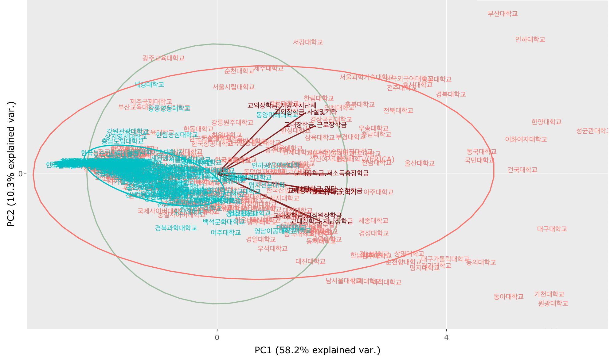

```{r, include = FALSE}
knitr::opts_chunk$set(
  collapse = TRUE,
  comment = "#>"
)
```

## Introduction

`soroban`'s `pcaModule` perform [pca](https://en.wikipedia.org/wiki/Principal_component_analysis) analysis and generates [Biplot](https://en.wikipedia.org/wiki/Biplot).

In this article, we'll use `scholarship` dataset of [datatoys](https://github.com/statgarten/datatoys)

This article is based on **0.0.1** Version of soroban

## Declare module

`soroban`'s module assumes that used in the [Shiny](https://shiny.rstudio.com/) application.

and You can use snippet(type `shinyapp`) to build very basic shiny application.

``` r
library(shiny)

ui <- fluidPage(
 
)

server <- function(input, output, session) {
  
}

shinyApp(ui, server)
```

This application will show nothing.

So let's add `pcaModule` in **ui**.

``` r
ui <- fluidPage(
  mod_pcaModule_ui(
    id = 'module'
  )
)
```

also, `pcaModule` in **server**.

``` r
server <- function(input, output, session) {
  mod_pcaModule_server(
    id = 'module', 
    inputData = reactive(datatoys::scholarship)
  )
}
```

So final (which is very basic) code will like this. (Assume data from `AER` loaded.)

``` r
library(shiny)

ui <- fluidPage(
  mod_pcaModule_ui(
    id = 'module'
  )
)

server <- function(input, output, session) {
  mod_pcaModule_server(
    id = 'module', 
    inputData = reactive(datatoys::scholarship) # remotes::install_github('statgarten/datatoys')
  )
}

shinyApp(ui, server) # Run application
```

You should notice 2 things.

1.  both `id` in **ui** and **server** should be same.
2.  `inputData` in **server** should be format of **reactive**

## Structure of pcaModule



pcaModule is consisted with `Control Area` and `Result Area`

and below using flow.

1.  Declare module (we did already)
2.  select variable to analysis. (and if data has different scale, check `normalize`) 2-1. (Optional) adjust plot's height (we consider modify UI in further version)
3.  `Draw`

## Usage of pcaModule

Using `scholarship`, we'll see which factor makes university differ.

However, we should change data's type first.

since PCA module requires options with types.

1.  change `학제별` to factor. it has category with `University` and `College`.

``` r
mod_pcaModule_server(
    id = 'module', 
    inputData = reactive(datatoys::scholarship %>% mutate()) 
  )
```

2.  fill variables like below image; they mean type of scholarship. (other are sum of schoar so they removed)



(`대학명` means name of university, which will be used Label (optional))

then result will be shown.



note that some university shows like outlier, which means they provide more scholarships to student. (like Seoul Univ.)



After some move / zoom figure (it uses [plotly](https://github.com/plotly/plotly.R) so you can use their interactive feature), we can see many types of scholarship is provided forward [Red]{style="color:red"} that is university and [Blue]{style="color:cyan"} is college.

For any issue or suggestion, please make issue in [soroban's github](https://github.com/statgarten/soroban/issues).
