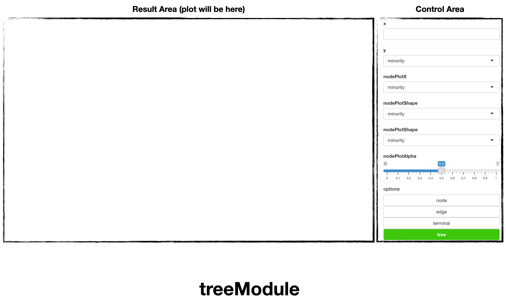
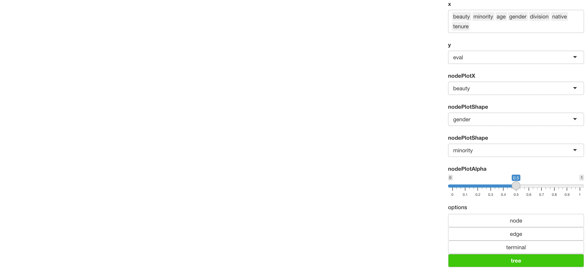
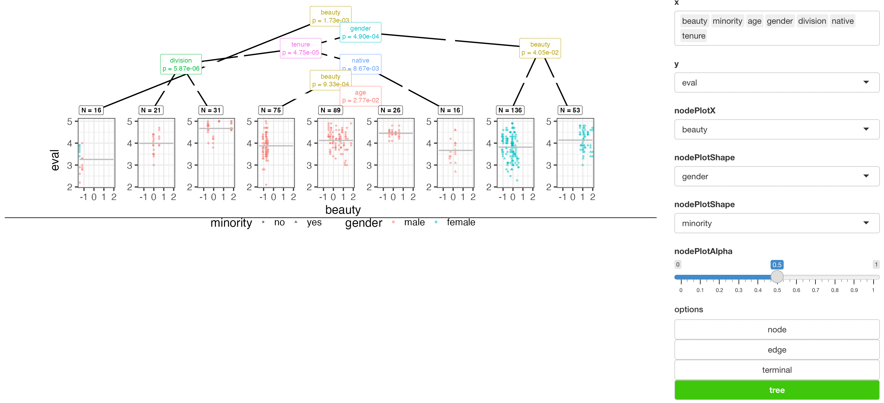

```{r, include = FALSE}
knitr::opts_chunk$set(
  collapse = TRUE,
  comment = "#>"
)
```

## Introduction

`soroban`'s `treeModule` generates [Decision tree](https://en.wikipedia.org/wiki/Decision_tree_learning).

In this article, we'll use `TeachingRatings` dataset of [AER](https://cran.r-project.org/web/packages/AER/index.html)

``` r
library(AER)
data('TeachingRatings')
```

This article is based on **0.0.1** Version of soroban

## Declare module

`soroban`'s module assumes that used in the [Shiny](https://shiny.rstudio.com/) application.

and You can use snippet(type `shinyapp`) to build very basic shiny application.

``` r
library(shiny)

ui <- fluidPage(
 
)

server <- function(input, output, session) {
  
}

shinyApp(ui, server)
```

This application will show nothing.

So let's add `treeModule` in **ui**.

``` r
ui <- fluidPage(
  mod_treeModule_ui(
    id = 'module'
  )
)
```

also, `treeModule` in **server**.

``` r
server <- function(input, output, session) {
  mod_treeModule_server(
    id = 'module', 
    inputData = reactive(TeachingRatings)
  )
}
```

So final (which is very basic) code will like this. (Assume data from `AER` loaded.)

``` r
library(shiny)

ui <- fluidPage(
  mod_treeModule_ui(
    id = 'module'
  )
)

server <- function(input, output, session) {
  mod_treeModule_server(
    id = 'module', 
    inputData = reactive(TeachingRatings)
  )
}

shinyApp(ui, server)
```

You should notice 2 things.

1.  both `id` in **ui** and **server** should be same.
2.  `inputData` in **server** should be format of **reactive**

## Structure of treeModule



treeModule is consisted with `Control Area` and `Result Area`

and below using flow.

1.  Declare module (we did already)
2.  select variable to generate tree. 2-1. (Optional) adjust tree layout option like `Edge` and `Node`, `Terminal of tree`
3.  build `Tree`

## Usage of treeModule

Using `TeachingRatings`, we'll see which factor effects teacher's evaluation.

Set X as `beauty`, `minority`, `age` ,`gender`,`division`,`native`,`tenure` (order is not important)

and Y as `eval`.

that is we want to model `Evaluation` with 7 factors

Also, the treeModule supports regression too.

select **nodePlot** options to `beauty`, `gender`, `minority` (typo will fixed in further version)



and after **Tree**, generated tree will be shown.



Result shows that, `beauty` and other factor's effect to teacher evaluation. and below scatter plot is regression for relation between `beauty` and `eval` based on `gender`.

(We consider change nodePlot option may not required in further version)

However if we change some **character** type value to **factor**, (which is more accurate) result will also changed.

For any issue or suggestion, please make issue in [soroban's github](https://github.com/statgarten/soroban/issues).
